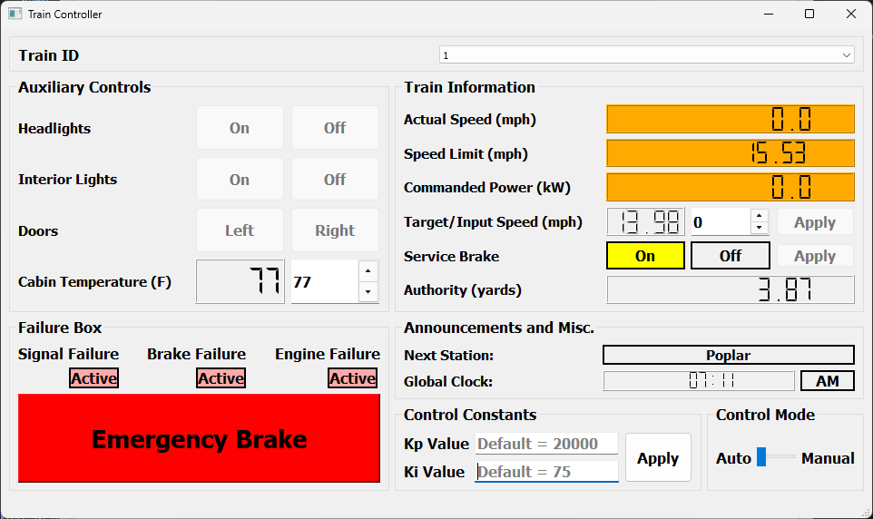
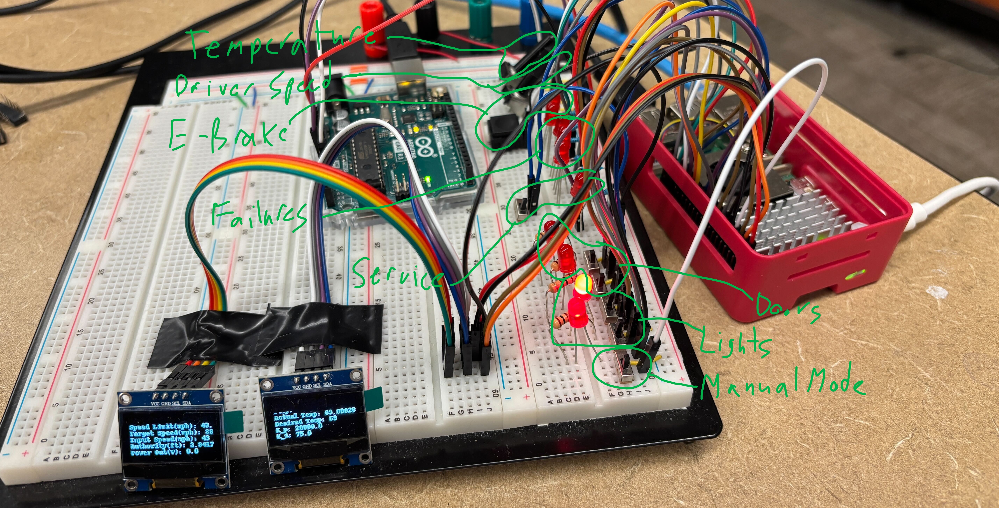

# ECE1140ChooChoo - Team Choo Choo Train System

## MEMBERS:
| Name | Module |
| ----------- | ----------- | 
| Aaron Kuchta | CTC |
| Connor Murray | SW Track Controller |
| PJ Granieri |  Track Model |
| Iyan Nekib |  Train Model |
| Aragya Goyal | SW Train Controller |
| Connor Marsh | HW Train Controller |

## Project Description
Code for ECE1140: Systems and Project Engineering, informally known as "Trains". Project consists of creating a simulation of the entire Pittsburgh Regional Transit Railway, with a deep focus on proper Systems Engineering methodology.

## Documentation
For the project, our team created IEEE documents following the IEEE 828, 829, 830 and 1016 standards. Our team has also created a coding standards document and this help guide.

## Deployment
### Installation Instructions
Clone this repository locally
Install anaconda, open an anaconda powershell prompt through the anaconda navigator.
Navigate in that powershell to this github repositories cloned location, then run this command:
`conda env create -f environment.yml`

Now activate that environment with `conda activate TeamChooChoo`

Now you are ready to run the code. All the program files are within the ***src*** folder. The main program file is ***pittsburgh.py***.  
See the **Starting the Simulation** Section to see how to run the code.

### Adding packages
To add a new package, run this command:
`conda install -c conda-forge [module_name]=[module_version]`
If the conda-forge channel doesn't have that package, you can remove the `-c conda-forge` part. You can also search packages on [Anaconda website](anaconda.org) to see which channels have a certain package.

Then to update the environment.yml file, run this command:
`conda env export > environment.yml`
***Then remove the prefix line, which is specific to your computer. After that you are good to commit the new environment file.***

### Raspberry Pi/Hardware Train Controller Module Setup
To setup the hardware train controller module, there are extra steps you have to take. First off you need to have the physical hardware module, which is a rasberrypi connected to an arduino (being used as a glorified analog to digital converter), connected to a breadboard with a handful of IO peripherals such as LED's, buttons, switches, and OLED displays.

Make sure that rasperry pi is powered on, you should see the green light on the board. The arduino should be connected to the pi over usb, it should also be powered on now with two orange lights and one green light.

#### Connection between hardware and software
The communication between hardware and software uses ssh over ethernet connection. To have your computer communicate with the pi without going through a wifi router first, we have to mess around with the IP addressing of the devices.

The pi is already set up so that it has a static IP of 192.168.137.10, a subnet mask of 24, and a gateway of 192.168.137.1. The gateway is the IP of the host device which it is communicating with.

What you have to do is manually set the IP of your ethernet connection to be the correct IP settings. Go into Control Panel, Network and Internet, Network and Sharing Center, Change adapter settings.  
Then double click on your connected ethernet, then click properties (requires admin), then select IPV4 and click properties. Then select "Use the following IP Address", and input IP=192.168.137.1, Subnet Mask=255.255.255.0, and leave gateway blank.  
This may take a moment to fully go through and be updated.

After this, the hardware setup should be compete. To confirm that you have proper connection with the hardware, open a terminal and run `ssh connor-marsh@192.168.137.10` and the password is `ece1140`. If this ssh connects properly, you can run `exit` to leave ssh. Lastly when you run the code, make sure to pass command line argument saying that you want to use the hardware module. So run `python3 src/pittsburgh.py USING_HARDWARE`

## Usage
### Starting the Simulation
To run our fully integrated simulation, simply run ***pittsburgh.py*** from the repository root with `python3 src/pittsburgh.py`.

#### Running modules
To run an individual module, or smaller combination of modules and testbenches, you have to pass that as a command line argument like `python3 src/pittsburgh.py TrainModel`.

Note that some modules may not run individually at the moment due to last minute changes during integration. The system is best run when fully integrated.

##### Run the fully integrated system
Command line argument: "all" (default, runs all modules but only starts with green line uploaded) or "allOnRed" (runs all modules but also starts with both green and red lines uploaded)  
##### Run individual modules with their testbenches
Command line argument: "CTC", "WaysideController", "TrackModel", "TrainModel", "TrainController" or "TrainControllerHW" (requires hardware to be setup and connected)  
##### Run specific combinations of modules
Command line argument: "CTCWayside" (runs just those two modules and tests their comms), "TrackWayside" (Fully integrated system but with no CTC) or "Train" (Train model and train controller integrated, testbench to get values from track model)

## UI Descriptions
### CTC UI
The Centralized Traffic Control (CTC) user interface is organized into three main sections and four functional subsections. Upon launch, the interface defaults to displaying the Green Line on the main screen.
#### Top Bar Features:
- Active Train Counter – Displays the number of currently active trains.
- Line Selector Slider – Switches between the Green and Red lines.
- Maintenance Mode Toggle – Enables or disables maintenance controls.
- 12-Hour Clock – Provides real-time timekeeping.
#### Main Interface Layout:
#### Left Section (Track View):
- Displays a visual representation of the currently active track. Users can select individual blocks from this view or from the adjacent table to view specific details, including Block ID, speed limit, and length. The line's total throughput is also shown here. In Maintenance Mode, a large dial becomes available to manually change the state of track switches.
#### Right Section (Train Table):
- Displays real-time information about all active trains. Navigation buttons allow users to access the four functional subsections
#### Subsections:
#### Dispatch Train
Allows users to dispatch trains from the yard.
- Dispatch Type: Choose between dispatching a new train or rerouting an existing one.
- Destination Type: Select a route, station, or specific block.
- Once selections are made, the dispatch button becomes active to initiate the process.

#### Select Train
Enables manual control of any active train.
- Users input desired authority and speed, which are validated to prevent unsafe entries.
- Once submitted, the train is marked as being in manual mode via a radio button indicator.

#### Maintenance
Provides block maintenance functionality.
- After enabling Maintenance Mode via the top bar, users can select blocks and toggle their maintenance status using "Start Maintenance" and "End Maintenance" buttons.

#### Upload Schedule
Opens a file explorer dialog allowing the user to upload a schedule file.
- The selected file is then parsed and integrated into the train scheduling system.
- This feature supports automated train dispatching and timeline-based coordination based on pre-configured schedules.
### Wayside Controller UI
This module is responsible for executing the PLC program and operates the devices on the track. The UI displays the controllers name and line in the top left corner.

#### Import PLC Program
Allows the programmer to upload a PLC program.
- Click the green "Import PLC Program Button" to open the file manager
- The user must select a .py file.
- If the selected file does not conform, ie. is not a .py, sends non-boolean values, or does not contain the "plc_logic" function, then the file manager will reopen until a proper file has been selected
- Once a valid program has been uploaded, The name of the program is displayed on the ui above the "Import PLC" button.
#### Controller Selection Drop Down
A combo box / drop down that shows the mode of the controller
#### Automatic Mode Drop Down
A combo box / drop down that shows the mode of the controller.
- Clicking on the drop down will show the modes available to select
- The user can choose between automatic and maintenance mode
- If the mode cannot be selected, ie. there is a train in the territory of the wayside controller, then the mode will not change
- Entering maintenance mode opens another window, where the user can edit values input into the wayside controller.
#### Central Block Table
The main table that displays, occupancies, suggested speeds, suggested authorities, commanded speeds, and commanded authorities.
- The user can scroll to view the values at each block in a wayside's territory.
#### Device Lists
At the bottom left corner of the window are three lists that show the devices that the wayside has control of.
- Clicking on an item on the list shows the output that is currently being made by the PLC program on the corresponding label in the bottom right of the screen.
### Wayside Controller Maintenance Window
A separate window that lets the programmer input values manually into the plc.
#### Block List
Shows each of the blocks on the wayside's territory and allows the user to select blocks
- Clicking on the block selects the block
- Scrolling allows the user to see all of the blocks in the territory
- List indicates which devices on are the track.
#### Set Occupancy Drop Down and Confirm Button
A combo box that changes the status of the selected block's occupancy and a Button to send the change to the main UI
- Three options, unoccupied, occupied, and maintenance
#### Set Switch Position Drop Down and Confirm Button
A combo box that changes the status of the selected switches' state and a Button to send the change to the main UI
- Select between the two switch states, displays the block numbers which corresponds to the switch
#### Set Light Signal Drop Down and Confirm Button
A combo box that changes the status of the selected light's state and a Button to send the change to the main UI
- Select Red or Green
#### Set Crossing Signal Drop Down and Confirm Button
A combo box that changes the status of the selected crossing's state and a Button to send the change to the main UI
- Select Inactive or Active

### Track Model UI
The Track Model user interface allows for dynamic visualization and interaction with the selected transit line. It supports both the Green and Red Lines and provides real-time feedback for block data, infrastructure status, temperature, and failure simulation.

#### Top Bar Features:
- Import Track Layout – Opens a file dialog to upload an updated `.xlsx` or `.xls` layout file. The file must match the selected line and contain "Green" or "Red" in cell A2.
- Track Layout must contain two sheets.
- Track Layout must contain columns called "Line", "Section", "Block Number", "Block Length", "Block Grade", "Station"...
- Continued, Track Layout must contain columns called "Station Side", "Switch", "Light", "Crossing", "Beacon", "Beacon Data"...
- Continued, "Territory", "Exit Blocks", "Switch Exits", "Speed Limit (MPH)", "Block Length (y)", "Underground" and "Traversal Time"
- Track Layout second sheet must have a column named "Sections" and a column named "Increasing"
- Sections are alphabetical values
- Increasing is "0", "1" or "2"
- Line Selector Dropdown – Switches between the Green and Red lines.
- Block Selector Dropdown – Allows selection of individual blocks by ID.
- 12-Hour Clock – Displays the current system time.
- Simulation Speed Input – Adjusts how quickly the simulation runs.
- Temperature Input – Accepts user input for track temperature.
- Track Heaters Display – Automatically updates based on the temperature to show whether heaters are enabled or disabled.

#### Main Interface Layout:
#### Center Section (Track Layout Map):
- Displays a zoomable, interactive map of the currently selected line.
- Users can click on individual blocks to view their data or select them via the dropdown.
- Real-time infrastructure icons appear on the map, including trains, stations, switches, signal lights, crossings, and failure indicators.
- Block occupancy and failure states are visually reflected on the map.

#### Bottom Left Section (Block Data):
- Shows detailed attributes for the currently selected block, including:
  - Block ID
  - Block Length (yd)
  - Speed Limit (mph)
  - Wayside Speed (if available)
  - Wayside Authority (if available)
  - Grade (%)
  - Elevation (yd)
  - Underground Status
  - Direction of Travel
  - Beacon Status
  - Railway Crossing Status

#### Bottom Center Section (Key):
- Displays a legend for interpreting icons shown on the track layout map.
- The following icons are included:
  - Train
  - Station
  - Switch
  - Signal Light
  - Railway Crossing
  - Maintenance Indicator
  - Track Circuit Failure
  - Broken Rail Failure
  - Power Failure

#### Bottom Right Section (Failure Modes and Selected Object Information):
- Failure Modes:
  - Toggle individual block failures using the "Edit" buttons:
    - Track Circuit Failure
    - Broken Rail Failure
    - Power Failure
  - Use the "Reset Errors" button to clear all failures on the map.

- Selected Object Information:
  - When an infrastructure icon is clicked, its data is displayed.
    - Train – Displays location, speed, authority, direction, and passenger count.
    - Station – Displays name, ticket sales, boarding, and departing counts.
    - Switch – Displays connected blocks and current route.
    - Signal Light – Shows current signal state.
    - Railway Crossing – Indicates whether the crossing is active or inactive.

### Train Model UI

This user interface provides real-time visualization and interaction with a simulated train model. It is organized into distinct sections for intuitive monitoring of model state, failure injection, control toggles, and displaying live train data.

#### Train Selection
- **Train ID:** Displays the identifier of the current train model instance being simulated.

#### Advertisements
- **Rotating Banners:** Cycles through a series of advertisement images at startup and every 5 seconds thereafter.

#### Announcement and Clock
- **ANNOUNCEMENT:** Shows any system or operator messages.  
- **Global Clock:** Displays current time in 12-hour format (e.g., 07:03 AM).

#### Failure Box
- **Brake Failure:** Toggleable status indicator (Enabled/Disabled).  
- **Signal Failure:** Toggleable status indicator (Enabled/Disabled).  
- **Engine Failure:** Toggleable status indicator (Enabled/Disabled).  
- **Emergency Brake:** Large red button that immediately engages the emergency brake on the model. (Can only be enabled by passengers, not disabled)

#### Model Metrics
- **Current Engine Power (kW):** Real-time display of the engine’s power output.  
- **Acceleration (ft/s²):** Shows the current model acceleration.  
- **Actual Velocity (mph):** Displays the train’s simulated speed.

#### Live Train Data
- **Wayside Speed (mph):** Speed limit imposed by the wayside controller.  
- **Wayside Authority (yds):** Remaining distance the train is permitted to travel.  
- **Vehicle Length (ft):** Physical length of the train.  
- **Height (ft):** Height of the train model.  
- **Width (ft):** Width of the train model.  
- **Vehicle Mass (lbs):** Mass used for physics calculations.  
- **Passengers:** Number of passengers currently onboard.  
- **Crew Count:** Number of crew members.  
- **Grade (%):** Track incline percentage.  
- **Distance Travelled (yds):** Total distance covered since spawn.

#### Auxiliary Controls (Confirmation Lights)
- **Service Brakes:** Toggle ON/OFF to apply or release service brakes.  
- **Exterior Lights:** Toggle ON/OFF lighting for exterior fixtures.  
- **Interior Lights:** Toggle ON/OFF lighting inside the cabin.  
- **Left Door / Right Door:** Buttons to OPEN or CLOSE each side’s doors.

#### Cabin Temperature
- **Temperature Display (°F):** Shows current cabin temperature in Fahrenheit.

---

#### Notes
- Advertisements are for demonstration only and can be replaced via the `Assets` directory.  
- Failure toggles simulate fault conditions; use these to test control-mode responses.  
- All numerical displays update in real time based on the underlying simulation loop.  
- Emergency Brake overrides all other controls until the failure is cleared/Train Driver disables it

### Train Controller SW UI
This user interface provides real-time monitoring and control capabilities for a train controller system. It is organized into distinct sections for intuitive interaction and quick access to critical information.

#### Train Selection
- **Train ID:** Dropdown menu to select which train to monitor and control.

#### Auxiliary Controls
- **Headlights & Interior Lights:** Toggle controls for turning on/off lighting systems.
- **Doors:** Buttons to control the opening and closing of left and right-side train doors.
- **Cabin Temperature:** Displays and allows adjustment of the cabin temperature in Fahrenheit.

#### Train Information
- **Actual Speed:** Displays the current speed of the train (in mph).
- **Speed Limit:** Displays the current track speed limit (in mph).
- **Commanded Power:** Shows the power command sent to the train (in kW).
- **Target/Input Speed:** Allows manual input of a desired speed and applying it in manual mode (in mph).
- **Service Brake:** Toggle control for applying or releasing the service brake. There are also lights to display whether the service brake is applied or not.
- **Authority:** Displays the remaining travel authority (distance permitted in yards).

#### Failure Box
- Displays the current status of:
  - **Signal Failure**
  - **Brake Failure**
  - **Engine Failure**
- Includes a large **Emergency Stop** button to trigger an emergency stop or response.

#### Announcements and Miscellaneous
- **Next Station:** Display for the upcoming station.
- **Global Clock:** Displays the current system time in 12-hour format.

#### Control Constants
- **Kp & Ki Values:** Fields to view or adjust the proportional and integral gain constants used for control logic. To be accessed by the Train Engineer. Once these are applied - they cannot be changed.

#### Control Mode
- Allows switching between **Automatic** and **Manual** control modes. This will enable/disable some controls depending on which mode you are in.

#### Notes regarding Train Controller
- Once service brake are applied in manual mode, the driver must untoggle the service brakes in order for the train to move since you are in manual mode.

### Train Controller HW UI
The hardware train module only exists for a single train at a time, as opposed to the software train module which will list all the trains. When we are using the hardware module, and we dispatch multiple trains from the yard, the *second* train to be dispatched will be created as a hardware train, and the hardware UI will control that train. In the software UI you will see that the second train has most of its functionality missing, because it is in hardware instead. Also if later in time, the hardware train goes to the Yard, then when the next train gets dispatched from the yard, if there is at least one software train on the track, then that train will be hardware. There can only ever be one hardware train at a time.

Note, the hardware code exists on the py-code branch. 

The hardware UI works the same as the SW Train Controller UI, but everything exists with physical buttons, switches, and dials.

Also importantly, note that even the HW train module still has a slight software UI component. The train engineer uses the software UI to set the Kp and Ki gains, then the train driver exclusively uses the hardware UI.
The labeling of all the physical buttons, switches, and dials, are shown in this image: 

## Common User Errors
1. - Windows has modules zoomed in by 200%, may tarnish the view of some modules.
2. - Not selecting all required dispatching options
3. - Incorrect schedule/track/PLC file type
   - Not having "Pittsburgh.py" mode set to "All"
   
